# PolarFire_SoC_FPGA_Discovery_Kit_Pinout
Pinout for PolarFire SoC FPGA Discovery Kit

# [FPGA Pinout](./pinout_Discovery_Kit.pdf)

| Pin Name |	Pin Number |	Direction |	Voltage |	FPGA bank |
| :-------- | :----------- | :----------- | :------ | :---------- |
| CLK_50MHz	| R18	| In	| 1.8V	| 0 |
| LED1(LOW LEVEL ACTIVE)	| T18	| Out	| 1.8V	| 0 |
| LED2(LOW LEVEL ACTIVE)	| V17	| Out	| 1.8V	| 0 |
| LED3(LOW LEVEL ACTIVE)	| U20	| Out	| 1.8V	| 0 |
| LED4(LOW LEVEL ACTIVE)	| U21	| Out	| 1.8V	| 0 |
| LED5(LOW LEVEL ACTIVE)	| AA18	| Out	| 1.8V	| 0 |
| LED6(LOW LEVEL ACTIVE)	| V16	| Out	| 1.8V	| 0 |
| LED7(LOW LEVEL ACTIVE)**	| U15	| Out	| 1.8V	| 0 |
| SWITCH1 (LOW LEVEL ACTIVE)	| T19	| In	| 1.8V	| 0 |
| SWITCH2 (LOW LEVEL ACTIVE)	| U18	| In	| 1.8V	| 0 |
| DIP1 (LOW LEVEL ACTIVE)	| U17	| In	| 1.8V	| 0 |
| DIP2 (LOW LEVEL ACTIVE)	| Y16	| In	| 1.8V	| 0 |
| DIP3 (LOW LEVEL ACTIVE)	| R17	| In	| 1.8V	| 0 |
| DIP4 (LOW LEVEL ACTIVE)	| AA15	| In	| 1.8V	| 0 |
| DIP5 (LOW LEVEL ACTIVE)	| AA20	| In	| 1.8V	| 0 |
| DIP6 (LOW LEVEL ACTIVE)	| Y20	| In	| 1.8V	| 0 |
| DIP7 (LOW LEVEL ACTIVE)	| V21	| In	| 1.8V	| 0 |
| DIP8 (LOW LEVEL ACTIVE)	| AA19	| In	| 1.8V	| 0 |
| IO1	| V18	| Out	| 1.8V	| 0 |
| IO2	| W20	| Out	| 1.8V	| 0 |
| IO3	| Y19	| Out	| 1.8V	| 0 |
| IO4	| T17	| Out	| 1.8V	| 0 |
| IO5	| W16	| Out	| 1.8V	| 0 |
| IO6	| AA17	| Out	| 1.8V	| 0 |
| IO7	| V15	| Out	| 1.8V	| 0 |
| IO8	| Y15	| Out	| 1.8V	| 0 |
| UART_TX	| W21	| Out	| 1.8V	| 0 |
| UART_RX	| Y21	| In	| 1.8V	| 0 |
| RPI_GPIO3	| E18 | 		| 2.5V/3.3V (J45)*	| 1 |
| RPI_GPIO5	| F18 | 		| 2.5V/3.3V (J45)*	| 1 |
| RPI_GPIO7	| E12 | 		| 2.5V/3.3V (J45)*	| 1 |
| RPI_GPIO8	| A20 | 		| 2.5V/3.3V (J45)*	| 1 |
| RPI_GPIO10	| B21 	| 	| 2.5V/3.3V (J45)*	| 1 |
| RPI_GPIO11	| G18	| 	| 2.5V/3.3V (J45)*	| 1 |
| RPI_GPIO12	| E10	| 	| 2.5V/3.3V (J45)*	| 1 |
| RPI_GPIO13	| F21	| 	| 2.5V/3.3V (J45)*	| 1 |
| RPI_GPIO15	| F20	| 	| 2.5V/3.3V (J45)*	| 1 |
| RPI_GPIO16	| E21	| 	| 2.5V/3.3V (J45)*	| 1 |
| RPI_GPIO18	| F19	| 	| 2.5V/3.3V (J45)*	| 1 |
| RPI_GPIO22	| A19	| 	| 2.5V/3.3V (J45)*	| 1 |
| RPI_GPIO29	| D17	| 	| 2.5V/3.3V (J45)*	| 1 |
| RPI_GPIO31	| D18	| 	| 2.5V/3.3V (J45)*	| 1 |
| RPI_GPIO32	| B20	| 	| 2.5V/3.3V (J45)*	| 1 |
| RPI_GPIO33	| A15	| 	| 2.5V/3.3V (J45)*	| 1 |
| RPI_GPIO35	| B19	| 	| 2.5V/3.3V (J45)*	| 1 |
| RPI_GPIO36	| B15	| 	| 2.5V/3.3V (J45)*	| 1 |
| RPI_GPIO37	| B17	| 	| 2.5V/3.3V (J45)*	| 1 |
| RPI_GPIO38	| B14	| 	| 2.5V/3.3V (J45)*	| 1 |
| RPI_GPIO40	| E13	| 	| 2.5V/3.3V (J45)*	| 1 |
| MIKROBUS_AN	| G12	| 	| 2.5V/3.3V (J45)*	| 1 |
| MIKROBUS_RST(PULL-UP)	| B16	| 	| 2.5V/3.3V (J45)*	| 1 |
| MIKROBUS_CS(PULL-UP)	| C16	| 	| 2.5V/3.3V (J45)*	| 1 |
| MIKROBUS_SCK	| E17	| 	| 2.5V/3.3V (J45)*	| 1 |
| MIKROBUS_MISO	| A18	| 	| 2.5V/3.3V (J45)*	| 1 |
| MIKROBUS_MOSI	| E11	| 	| 2.5V/3.3V (J45)*	| 1 |
| MIKROBUS_PWM	| D13	| 	| 2.5V/3.3V (J45)*	| 1 |
| MIKROBUS_INT(PULL-UP)	| G17	| 	| 2.5V/3.3V (J45)*	| 1 |
| MIKROBUS_RX	| E14	| 	| 2.5V/3.3V (J45)*	| 1 |
| MIKROBUS_TX	| E15	| 	| 2.5V/3.3V (J45)*	| 1 |
| MIKROBUS_SCL(PULL-UP)	| D11	| 	| 2.5V/3.3V (J45)*	| 1 |
| MIKROBUS_SDA(PULL-UP)	| D12	| 	| 2.5V/3.3V (J45)*	| 1 |
| ETH_MDC(PULL-UP)	| D15	| Out	| 2.5V/3.3V (J45)*	| 1 |
| ETH_MDIO(PULL-UP)	| J9	| Out	| 2.5V/3.3V (J45)*	| 1 |
| ETH_MDINTB(PULL-UP)	| A13	| Out	| 2.5V/3.3V (J45)*	| 1 |
| ETH_RESETn(PULL-UP)	| A14	| Out	| 2.5V/3.3V (J45)*	| 1 |
| ETH_RXLOS	| A17	| Out	| 2.5V/3.3V (J45)*	| 1 |
| ETH_TXDISn(PULL-UP)	| E20	| Out	| 2.5V/3.3V (J45)*	| 1 |
| GPIO_MIPI_RX_N0	| B11	| Out	| 2.5V/3.3V (J45)*	| 1 |
| GPIO_MIPI_RX_P0	| C11	| Out	| 2.5V/3.3V (J45)*	| 1 |
| GPIO_MIPI_RX_N1	| A10	| Out	| 2.5V/3.3V (J45)*	| 1 |
| GPIO_MIPI_RX_P1	| B10	| Out	| 2.5V/3.3V (J45)*	| 1 |
| GPIO_MIPI_RX_CKN	| B12	| Out	| 2.5V/3.3V (J45)*	| 1 |
| GPIO_MIPI_RX_CKP	| A12	| Out	| 2.5V/3.3V (J45)*	| 1 |
| CAM_EN	| Y14	| In	| 1.8V	| 0 |
| CAM_I2C_SDA(PULL-UP)	| T20	| In	| 1.8V	| 0 |
| CAM_I2C_SCL(PULL-UP)	| T21	| In	| 1.8V	| 0 |
| CAM_GPIO	| Y17	| In	| 1.8V	| 0 |

*-
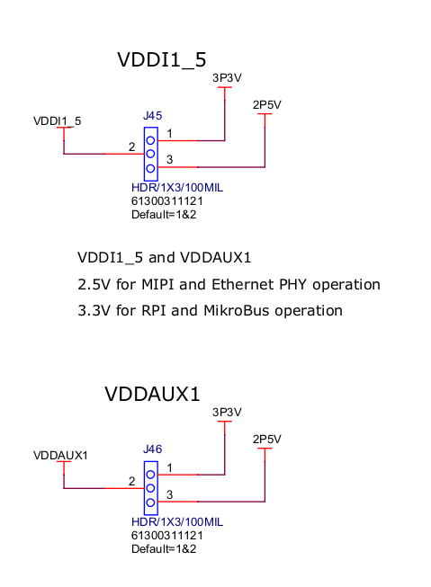

** LED8 controlled by MSS with 3.3V

# Live Probes (J12). _Debugging pins:_

| Pin	| Name	| Function |
| :-------- | :----------- | :----------- |
| 1	| LPRB_B (C20)	| Live Probe B |
| 2	| LPRB_A (C21)	| Live Probe A |
| 3	| GND	 |
| 4	| GND	 |

# Raspberry Pi 4 Interface

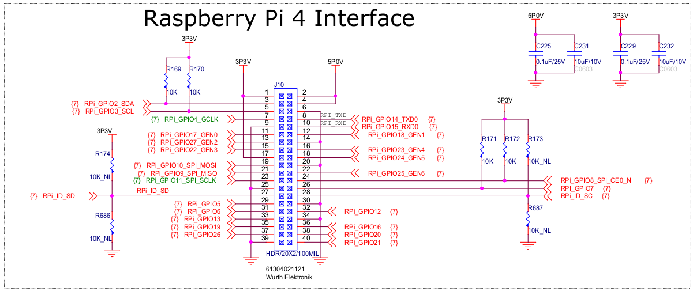

| PIN CONNECTOR	| PIN FPGA	| TYPE PIN	| VOLTAGE	| BANK |
| :-------- | :----------- | :----------- | :------ | :---------- |
| 1	| 	| SOURCE	| 3.3V |	
| 2	| 	| SOURCE	| 5V	|  |
| 3	| E18	| HSIO	| 2.5V/3.3V (J45)	| 1 |
| 4	| 	| SOURCE	| 5V	|  |
| 5	| F18	| HSIO	| 2.5V/3.3V (J45)	| 1 |
| 6	| | 	SOURCE	| GND	|  |
| 7	| E12	| HSIO	| 2.5V/3.3V (J45)	| 1 |
| 8	| A20	| HSIO	| 2.5V/3.3V (J45)	| 1 |
| 9	| 	| SOURCE	| GND	|  |
| 10	| B21	| HSIO	| 2.5V/3.3V (J45)	| 1 |
| 11	| G18	| HSIO	| 2.5V/3.3V (J45)	| 1 |
| 12	| E10	| HSIO	| 2.5V/3.3V (J45)	| 1 |
| 13	| F21	| HSIO	| 2.5V/3.3V (J45)	| 1 |
| 14	| | 	SOURCE	| GND	|  |
| 15	| F20	| HSIO	| 2.5V/3.3V (J45)	| 1 |
| 16	| E21	| HSIO	| 2.5V/3.3V (J45)	| 1 |
| 17	| 	| SOURCE	| 3.3V	|  |
| 18	| F19	| HSIO	| 2.5V/3.3V (J45)	| 1 |
| 19	| A4	| MSS	| 3.3V	| 2 |
| 20	| 	| SOURCE	| GND	|  |
| 21	| B4	| MSS	| 3.3V	| 2 |
| 22	| A19	| HSIO	| 2.5V/3.3V (J45)	| 1 |
| 23	| D6	| MSS	| 3.3V	| 2 |
| 24	| D5	| MSS	| 3.3V	| 2 |
| 25	| 	| SOURCE	| GND	|  |
| 26	| B2	| MSS	| 3.3V	| 2 |
| 27	| D1	| MSS	| 3.3V	| 2 |
| 28	| C2	| MSS	| 3.3V	| 2 |
| 29	| D17	| HSIO	| 2.5V/3.3V (J45)	| 1 |
| 30	| 	| SOURCE	| GND	 |
| 31	| D18	| HSIO	| 2.5V/3.3V (J45)	| 1 |
| 32	| B20	| HSIO	| 2.5V/3.3V (J45)	| 1 |
| 33	| A15	| HSIO	| 2.5V/3.3V (J45)	| 1 |
| 34	| | 	SOURCE	| GND	 |
| 35	| B19	| HSIO	| 2.5V/3.3V (J45)	| 1 |
| 36	| B15	| HSIO	| 2.5V/3.3V (J45)	| 1 |
| 37	| B17	| HSIO	| 2.5V/3.3V (J45)	| 1 |
| 38	| B14	| HSIO	| 2.5V/3.3V (J45)	| 1 |
| 39	| 	| SOURCE	| GND	 |
| 40	| E13	| HSIO	| 2.5V/3.3V (J45)	| 1 |

# MIKROBUS

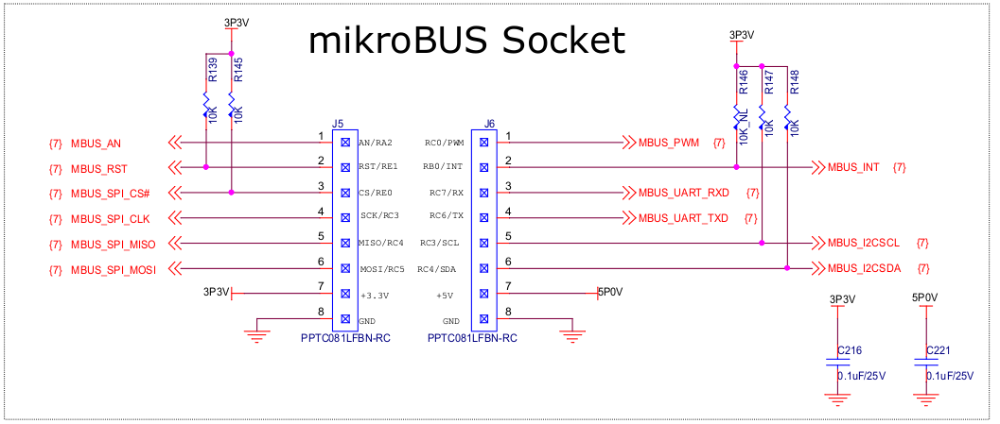

| CONNECTOR	| PIN	| NAME	| FPGA PIN	| VOLTAGE	| BANK |
| :-------- | :----------- | :----------- | :------ | :---------- | :---------- |
| J5	| 1	| MIKROBUS_AN	| G12	| 2.5V/3.3V (J45)	| 1 |
| J5	| 2	| MIKROBUS_RST(PULL-UP: 3V3)	| B16	| 2.5V/3.3V (J45)	| 1 |
| J5	| 3	| MIKROBUS_CS(PULL-UP: 3V3)	| C16	| 2.5V/3.3V (J45)	| 1 |
| J5	| 4	| MIKROBUS_SCK	| E17	| 2.5V/3.3V (J45)	| 1 |
| J5	| 5	| MIKROBUS_MISO	| A18	| 2.5V/3.3V (J45)	| 1 |
| J5	| 6	| MIKROBUS_MOSI	| E11	| 2.5V/3.3V (J45)	| 1 |
| J5	| 7	| 3V3			 |
| J5	| 8	| GND			 |
| J6	| 1	| MIKROBUS_PWM	| D13	| 2.5V/3.3V (J45)	| 1 |
| J6	| 2	| MIKROBUS_INT(PULL-UP: 3V3)	| G17	| 2.5V/3.3V (J45)	| 1 |
| J6	| 3	| MIKROBUS_RX	| E14	| 2.5V/3.3V (J45)	| 1 |
| J6	| 4	| MIKROBUS_TX	| E15	| 2.5V/3.3V (J45)	| 1 |
| J6	| 5	| MIKROBUS_SCL(PULL-UP: 3V3)	| D11	| 2.5V/3.3V (J45)	| 1 |
| J6	| 6	| MIKROBUS_SDA(PULL-UP: 3V3)	| D12	| 2.5V/3.3V (J45)	| 1 |
| J6	| 7	| 5V			 |
| J6	| 8	| GND			 |

# ETHERNET _(GPIO & MSS Pins)_

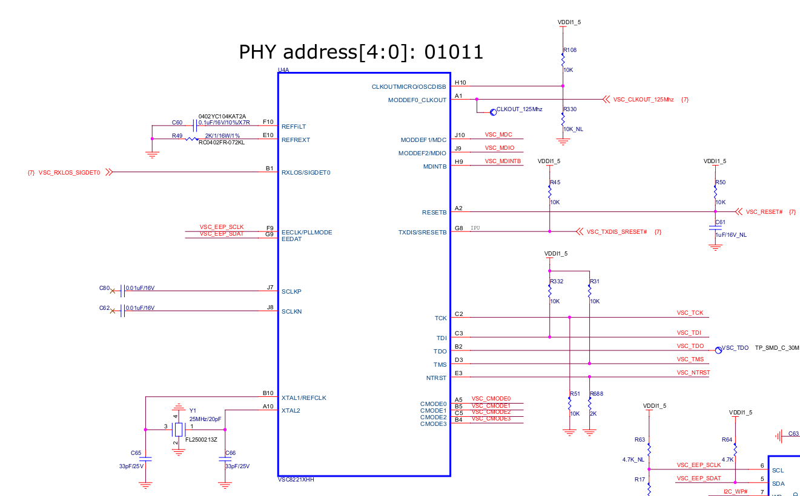

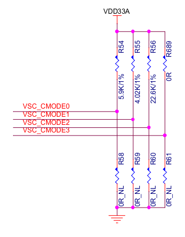

_*R58, R59, R60, R61 : NM → CMODE: 2_

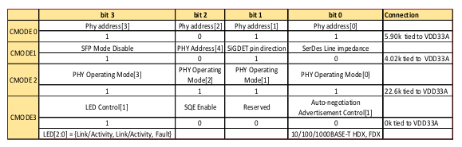

| Name	| FPGA Pin	| Type	| Voltage	| Bank |
| :-------- | :----------- | :----------- | :------ | :---------- |
| ETH_MDC(PULL-UP)	| D15	| Out	| 2.5V/3.3V (J45)	| 1 |
| ETH_MDIO(PULL-UP)	| J9	| Out	| 2.5V/3.3V (J45)	| 1 |
| ETH_MDINTB(PULL-UP)	| A13	| Out	| 2.5V/3.3V (J45)	| 1 |
| ETH_RESETn(PULL-UP)	| A14	| Out	| 2.5V/3.3V (J45)	| 1 |
| ETH_RXLOS	| A17	| Out	| 2.5V/3.3V (J45)	| 1 |
| ETH_TXDISn(PULL-UP)	| E20	| Out	| 2.5V/3.3V (J45)	| 1 |

… Other pins are MSS pins

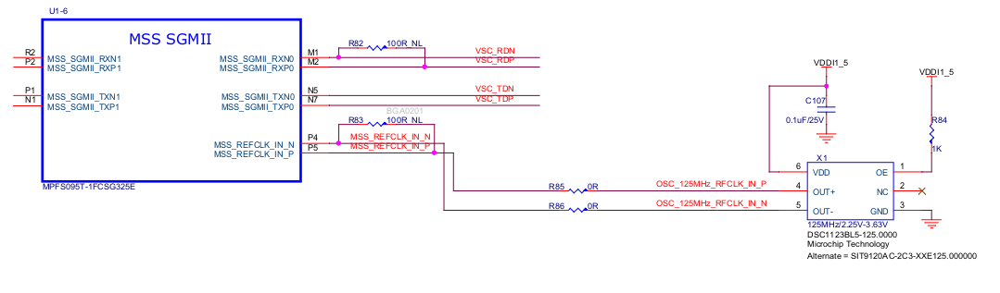

# MIPI Conector

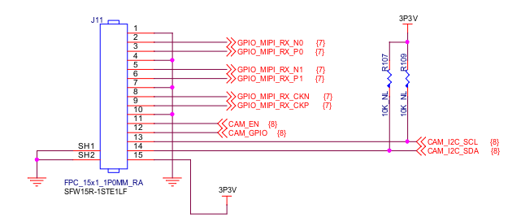

| Pin	| Name	| FPGA Pin	| Type	| Voltage	| Bank |
| :-------- | :----------- | :----------- | :------ | :---------- | :---------- |
| 1	| GND				 |
| 2	| GPIO_MIPI_RX_N0	| B11	| Out	| 2.5V/3.3V (J45)	| 1 |
| 3	| GPIO_MIPI_RX_P0	| C11	| Out	| 2.5V/3.3V (J45)	| 1 |
| 4	| GND				 |
| 5	| GPIO_MIPI_RX_N1	| A10	| Out	| 2.5V/3.3V (J45)	| 1 |
| 6	| GPIO_MIPI_RX_P1	| B10	| Out	| 2.5V/3.3V (J45)	| 1 |
| 7	| GND				 |
| 8	| GPIO_MIPI_RX_CKN	| B12	| Out	| 2.5V/3.3V (J45)	| 1 |
| 9	| GPIO_MIPI_RX_CKP	| A12	| Out	| 2.5V/3.3V (J45)	| 1 |
| 10	| GND				 |
| 11	| CAM_EN	| Y14	| In	| 1.8V	| 0 |
| 12	| CAM_GPIO	| Y17	| In	| 1.8V	| 0 |
| 13	| CAM_I2C_SDA(PULL-UP)	| T20	| In	| 1.8V	| 0 |
| 14	| CAM_I2C_SCL(PULL-UP)	| T21	| In	| 1.8V	| 0 |
| 15	| GND				 |

# 7 Segment Display

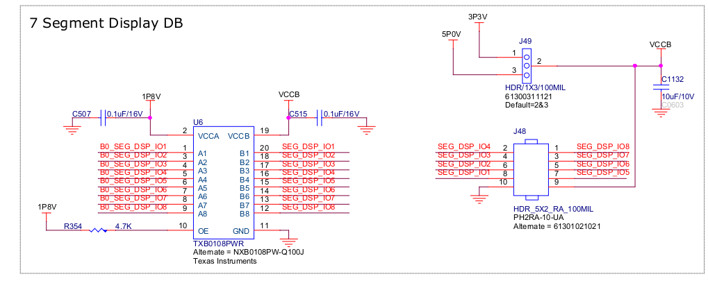

_FPGA Output voltage: 1.8V → Pin voltage: 3V3 / 5V (J49)_

| Name	| FPGA PIN	| Type	| Voltage	| FPGA Bank |
| :-------- | :----------- | :----------- | :------ | :---------- | 
| IO1	| V18	| Out	| 1.8V	| 0 |
| IO2	| W20	| Out	| 1.8V	| 0 |
| IO3	| Y19	| Out	| 1.8V	| 0 |
| IO4	| T17	| Out	| 1.8V	| 0 |
| IO5	| W16	| Out	| 1.8V	| 0 |
| IO6	| AA17	| Out	| 1.8V	| 0 |
| IO7	| V15	| Out	| 1.8V	| 0 |
| IO8	| Y15	| Out	| 1.8V	| 0 |

# SD CARD _(MSS Pins)_

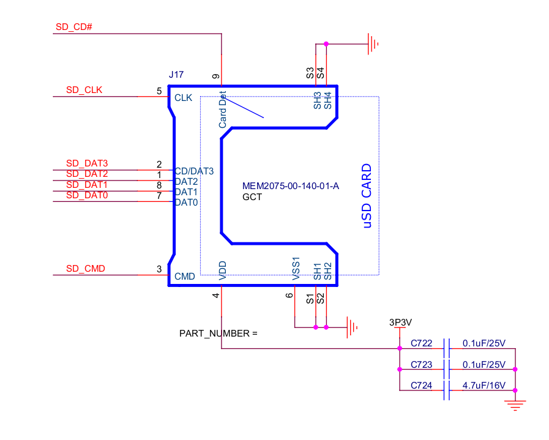

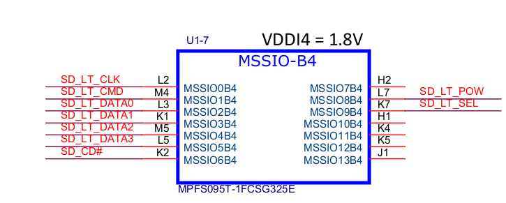

## [Schematic](PolarFire_SoC_Discovery_Kit_Rev2_SCH_090423_01.pdf)

## [User guide](./PolarFire_SoC_FPGA_Discovery_Kit_User_Guide.pdf)